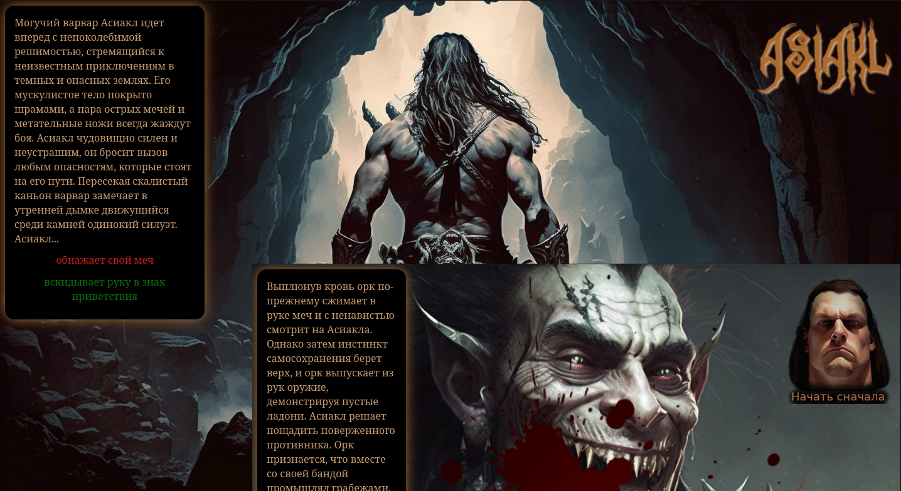

# Asiakl
Браузерная книга-игра-квест-комикс в сеттинге темного фентези. Представляет собой небольшое серверное джава веб-приложение (сервлеты + база данных), которое находится на стадии разработки. Приглашаю поучаствовать!🙂

## Описание
Приложение состоит из jsp-файла, который отображает контент, генерируемый сервлетами (аутентификации, текущего положения игры, выбора действия, возврата к началу игры). Всю необходимую информацию получаем из базы данных, в которой две таблицы: игроки (имя, пароль, текущее положение игры), контент (текст, выбор действия, ссылки на задний фон и дополнительные визуальные эффекты). Реализованы отдельные джава-классы для подключения к базе данных(config), информации об игроке (dao), допуска к игре (filter). Вход в игру происходит по паролю, после чего игрок начинает с того места, на котором остановился. Отключена возможность вернуться на предыдущую страницу, но можно начать игру сначала.

## Технологии
- Java Servlets, JavaServer Pages (JSP)
- PostgreSQL, JDBC
- Apache Tomcat, Maven

## Разработка
Форкайте и клонируйте себе репозиторий

Установите Maven и сервер Tomcat

Подключите базу данных:
- установите PostgreSQL 
- создайте базу данных Asiakl владелец postgres
- разместите файл asiakl.dump в домашей дирректории postgres
- восстановите базу данных из дампа (пароль БД: 123): 
```sh
    pg_restore -U postgres -d asiakl asiakl.dump
```
Запустите проект в Tomcat

Вход в игру в браузере после запуска приложения:
Имя: user
Пароль: pass

## To do
- [ ] Добавить регистрацию пользователей с хранением в БД зашифрованных паролей 
- [ ] Добавить авторизацию с распределением ролей: обычные пользователи и админ
- [ ] Добавить панель админа для удобного изменения и добавления контента в БД
- [ ] Добавить новые фичи
- [ ] Оптимизировать приложение 

## Команда проекта
- [alex96jvm](https://t.me/alex96jvm)

